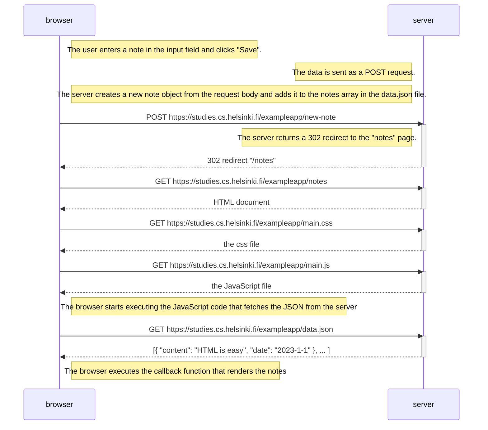

```mermaid
sequenceDiagram
    participant browser
    participant server

    Note right of browser: The user enters a note in the input field and clicks "Save".

     Note left of server: The data is sent as a POST request.

     Note left of server: The server creates a new note object from the request body and adds it to the notes array in the data.json file.

    browser->>server: POST https://studies.cs.helsinki.fi/exampleapp/new-note
    activate server

    Note left of server: The server returns a 302 redirect to the "notes" page.

    server-->>browser: 302 redirect "/notes"
    deactivate server

    browser->>server: GET https://studies.cs.helsinki.fi/exampleapp/notes
    activate server
    server-->>browser: HTML document
    deactivate server

    browser->>server: GET https://studies.cs.helsinki.fi/exampleapp/main.css
    activate server
    server-->>browser: the css file
    deactivate server

    browser->>server: GET https://studies.cs.helsinki.fi/exampleapp/main.js
    activate server
    server-->>browser: the JavaScript file
    deactivate server

    Note right of browser: The browser starts executing the JavaScript code that fetches the JSON from the server

    browser->>server: GET https://studies.cs.helsinki.fi/exampleapp/data.json
    activate server
    server-->>browser: [{ "content": "HTML is easy", "date": "2023-1-1" }, ... ]
    deactivate server

    Note right of browser: The browser executes the callback function that renders the notes
```