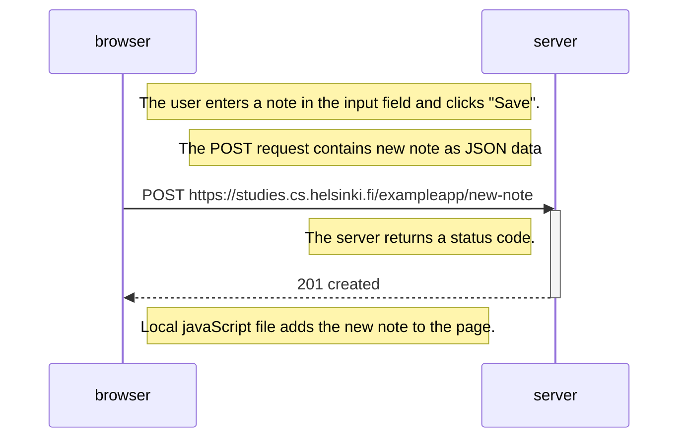

```mermaid
sequenceDiagram
    participant browser
    participant server

    Note right of browser: The user enters a note in the input field and clicks "Save".

    Note left of server: The POST request contains new note as JSON data

    browser->>server: POST https://studies.cs.helsinki.fi/exampleapp/new-note
    activate server

    Note left of server: The server returns a status code.

    server-->>browser: 201 created
    deactivate server

    Note right of browser: Local javaScript file adds the new note to the page.
```